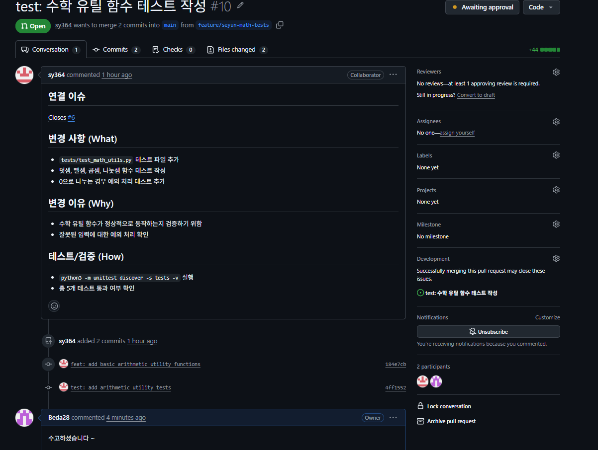

# 제출 증빙

## 1. 팀 정보 및 저장소

- 과정: Codyssey AI/SW 기초 2-2 팀 프로젝트
- 팀원: 방승규(@Beda28), 노신용(@ShinyongNoh), 김세윤(@sy364)
- 저장소: [Beda28/B2-2.Team](https://github.com/Beda28/B2-2.Team)

## 2. 팀원별 Issue / PR

| 팀원 | 작업 | Issue | PR |
| --- | --- | --- | --- |
| 방승규 | 협업 규칙 | [#1](https://github.com/Beda28/B2-2.Team/issues/1) | [#4](https://github.com/Beda28/B2-2.Team/pull/4) |
| 방승규 | 문자열 유틸 | [#2](https://github.com/Beda28/B2-2.Team/issues/2) | [#3](https://github.com/Beda28/B2-2.Team/pull/3) |
| 노신용 | 공백 정리 | [#7](https://github.com/Beda28/B2-2.Team/issues/7) | [#11](https://github.com/Beda28/B2-2.Team/pull/11) |
| 노신용 | 대소문자 변환 | [#8](https://github.com/Beda28/B2-2.Team/issues/8) | [#12](https://github.com/Beda28/B2-2.Team/pull/12) |
| 김세윤 | 사칙연산 유틸 | [#5](https://github.com/Beda28/B2-2.Team/issues/5) | [#9](https://github.com/Beda28/B2-2.Team/pull/9) |
| 김세윤 | 수학 테스트 | [#6](https://github.com/Beda28/B2-2.Team/issues/6) | [#10](https://github.com/Beda28/B2-2.Team/pull/10) |
| 김세윤 | amend 실습 | [#17](https://github.com/Beda28/B2-2.Team/issues/17) | [#18](https://github.com/Beda28/B2-2.Team/pull/18) |

2026-10-10 GitHub 조회 기준으로 위 PR 7건의 병합을 확인했습니다.

## 3. 주요 문서

- [프로젝트 소개 및 함수 사용 예시](README.md)
- [협업 가이드](docs/CONTRIBUTING.md)
- [충돌 해결 기록](docs/conflict-resolution.md)
- [Git 트러블슈팅 기록](docs/troubleshooting-log.md)

## 4. 코드 리뷰 증빙

| 리뷰 작성자 | 기록 1 | 기록 2 | 확인 내용 |
| --- | --- | --- | --- |
| 방승규 | [PR #10 승인](https://github.com/Beda28/B2-2.Team/pull/10#pullrequestreview-5478384999) | [PR #11 승인](https://github.com/Beda28/B2-2.Team/pull/11#pullrequestreview-5478387875) | 승인 본문에 구체적인 피드백 없음 |
| 노신용 | [PR #3 댓글](https://github.com/Beda28/B2-2.Team/pull/3#issuecomment-6095664362) | [PR #4 댓글](https://github.com/Beda28/B2-2.Team/pull/4#issuecomment-6095669776) | 칭찬 댓글로, 실질적인 코드 리뷰 증빙은 아님 |
| 김세윤 | [PR #11 공백·탭·개행 피드백](https://github.com/Beda28/B2-2.Team/pull/11#pullrequestreview-5478390555) | [PR #12 혼합 문자열 테스트 피드백](https://github.com/Beda28/B2-2.Team/pull/12#pullrequestreview-5478388666) | 구체적인 피드백 2건, 작성자 답변 미확인 |

모든 팀원의 실질적인 리뷰 2건 및 작성자와의 상호작용 충족 여부는 추가 확인이 필요합니다.

위 이미지는 승인 전 화면이며 승인 기록은 표에 연결했습니다.

## 5. 충돌 실습 증빙

| 실습 | 충돌 파일 | 선행 PR | 해결 PR | 해결 커밋 |
| --- | --- | --- | --- | --- |
| 덧셈 테스트 기대값 | tests/test_math_utils.py | [#14](https://github.com/Beda28/B2-2.Team/pull/14) | [#13](https://github.com/Beda28/B2-2.Team/pull/13) | [736d049](https://github.com/Beda28/B2-2.Team/commit/736d049) |
| 문자열 공백 처리 | src/string_utils.py | [#15](https://github.com/Beda28/B2-2.Team/pull/15) | [#16](https://github.com/Beda28/B2-2.Team/pull/16) | [13b4c3c](https://github.com/Beda28/B2-2.Team/commit/13b4c3c) |

각 실습의 충돌 안내와 마커 화면 4장은 [충돌 해결 기록](docs/conflict-resolution.md)에 포함했습니다.

## 6. 트러블슈팅 증빙

| 항목 | 확인된 증빙 |
| --- | --- |
| git commit --amend | [Issue #17](https://github.com/Beda28/B2-2.Team/issues/17), [PR #18](https://github.com/Beda28/B2-2.Team/pull/18): 94d54b8 → 4f7346f |
| git reset --soft HEAD~1 | 실습 증빙 미확인 |
| git revert | 방승규: [추가 0712894](https://github.com/Beda28/B2-2.Team/commit/07128946f5431684333de54de746d974f38558b3) → [취소 1404e0d](https://github.com/Beda28/B2-2.Team/commit/1404e0d1a80c3f28a7f0f90a9d0a4d48abe30bf0), 파일 복구 및 두 커밋 push 확인 |
| git stash / git stash pop | 실습 증빙 미확인 |

## 7. Git 히스토리 증빙

- [git log --oneline --graph --all 출력](docs/git-history.txt)
- [main 커밋 히스토리](https://github.com/Beda28/B2-2.Team/commits/main/)
- [충돌 실습 1 병합: 6e76748](https://github.com/Beda28/B2-2.Team/commit/6e76748)
- [충돌 실습 2 병합: 1afaf55](https://github.com/Beda28/B2-2.Team/commit/1afaf55)
- [amend 실습 병합: 856c92e](https://github.com/Beda28/B2-2.Team/commit/856c92e)
- [revert 실습 브랜치 이력](https://github.com/Beda28/B2-2.Team/commits/feature/bsg-revert-demo/)

## 8. 최종 검증 및 문서 PR

- 검증 기준: 기능 복구 커밋 [cfefdc3](https://github.com/Beda28/B2-2.Team/commit/cfefdc3c311a97bf473fa8ea81db6f983198fece), Python 3.14.6. 수학 테스트 5개·문자열 입력 6종·모듈 실행 통과. [실행 방법](README.md#4-실행-및-검증)
- 최종 문서 PR: 생성 전
