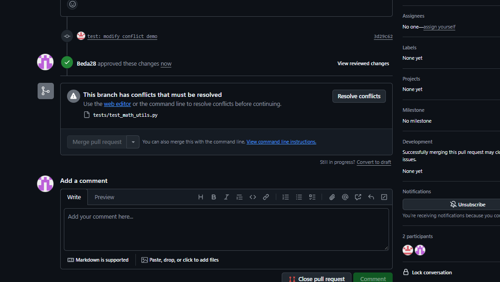
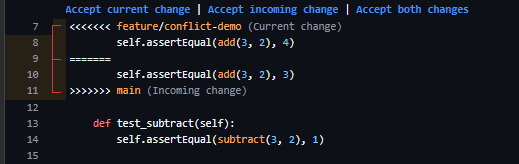
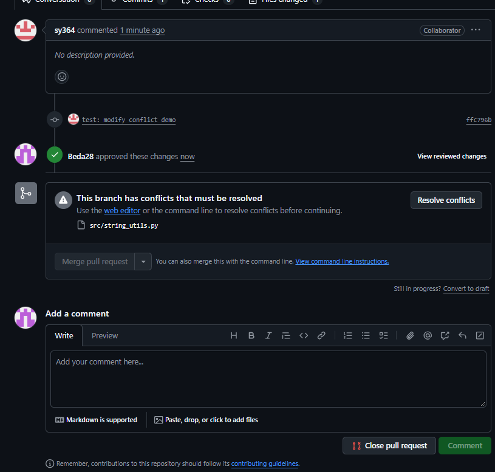
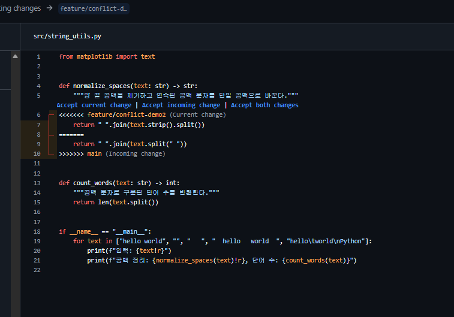

# 충돌 해결 기록

## 1. 덧셈 테스트 기대값 충돌

- 참여자: 김세윤(@sy364), 방승규(@Beda28)
- 발생 상황: 김세윤의 feature/conflict-demo와 방승규의 feature/bsg-conflict-test에서 같은 테스트의 기대값을 변경했습니다. PR #14가 main에 먼저 병합되면서 PR #13에 충돌이 발생했습니다.
- 충돌 파일: tests/test_math_utils.py
- 충돌 내용: test_add의 add(3, 2) 기대값이 feature/conflict-demo에서는 4, main에서는 3이었습니다.

### 해결 과정

1. PR #13에서 충돌 파일을 확인했습니다.
2. GitHub의 Resolve conflicts 화면에서 양쪽 기대값과 충돌 마커를 확인했습니다.
3. feature/conflict-demo의 기대값 4를 남긴 결과가 해결 커밋 736d049에 반영되었습니다.
4. main을 작업 브랜치에 병합한 뒤 PR #13을 main에 병합했습니다.

해결 수단은 GitHub 웹 편집기입니다. 별도의 터미널 명령어 사용 기록은 없습니다.

### 결과와 배운 점

- 관련 PR: [#14 선행 변경](https://github.com/Beda28/B2-2.Team/pull/14), [#13 충돌 해결 및 병합](https://github.com/Beda28/B2-2.Team/pull/13)
- 해결 커밋: [736d049](https://github.com/Beda28/B2-2.Team/commit/736d0498f6c5383e9cb657f2583ed61d11754c59)
- main 병합 커밋: [6e76748](https://github.com/Beda28/B2-2.Team/commit/6e76748)
- 문서 작성 시 Python 3.14.6에서 python -m unittest discover -s tests -v를 실행한 결과, 5개 중 4개 통과·1개 실패했습니다. add(3, 2)의 실제 값 5와 남겨진 기대값 4가 달랐습니다.
- 충돌 마커 제거와 병합 성공만으로 기능이 올바르다고 판단할 수 없습니다. 기대값의 의미를 검토하고 테스트를 실행해야 합니다.

## 2. 문자열 공백 정리 방식 충돌

- 참여자: 김세윤(@sy364), 방승규(@Beda28)
- 발생 상황: 김세윤의 feature/conflict-demo2와 방승규의 feature/bsg-test-txt에서 normalize_spaces의 반환식을 각각 변경했습니다. PR #15가 main에 먼저 병합되면서 PR #16에 충돌이 발생했습니다.
- 충돌 파일: src/string_utils.py
- 충돌 내용: feature/conflict-demo2는 text.strip().split(), main은 text.split(" ")을 사용했습니다. 두 결과를 각각 " ".join(...)으로 연결하는 코드였습니다.

### 해결 과정

1. PR #16의 충돌 안내에서 src/string_utils.py를 확인했습니다.
2. GitHub의 Resolve conflicts 화면에서 두 반환식과 충돌 마커를 비교했습니다.
3. text.strip().split()을 사용하는 반환식을 남긴 결과가 해결 커밋 13b4c3c에 반영되었습니다.
4. main을 작업 브랜치에 병합한 뒤 PR #16을 main에 병합했습니다.

해결 수단은 GitHub 웹 편집기입니다. 별도의 터미널 명령어 사용 기록은 없습니다.

### 결과와 배운 점

- 관련 PR: [#15 선행 변경](https://github.com/Beda28/B2-2.Team/pull/15), [#16 충돌 해결 및 병합](https://github.com/Beda28/B2-2.Team/pull/16)
- 해결 커밋: [13b4c3c](https://github.com/Beda28/B2-2.Team/commit/13b4c3cdfc6413f71b48c013fd24b35a4ff7bcc6)
- main 병합 커밋: [1afaf55](https://github.com/Beda28/B2-2.Team/commit/1afaf55)
- 문서 작성 시 python -m src.string_utils 실행은 ModuleNotFoundError로 실패했습니다. 충돌 실습 중 추가된 from matplotlib import text가 남아 있으며, 검증 환경에는 matplotlib이 설치되어 있지 않습니다.
- split()은 연속 공백·탭·개행을 구분자로 처리하지만 split(" ")은 단일 공백만 구분자로 사용하므로 결과가 다릅니다. 충돌한 줄뿐 아니라 함께 유입된 import도 검토해야 합니다.
